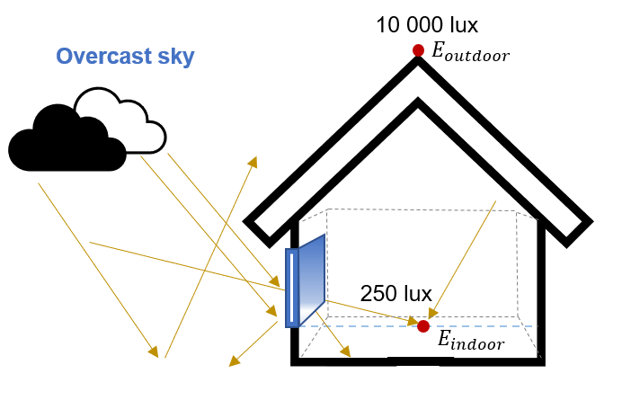
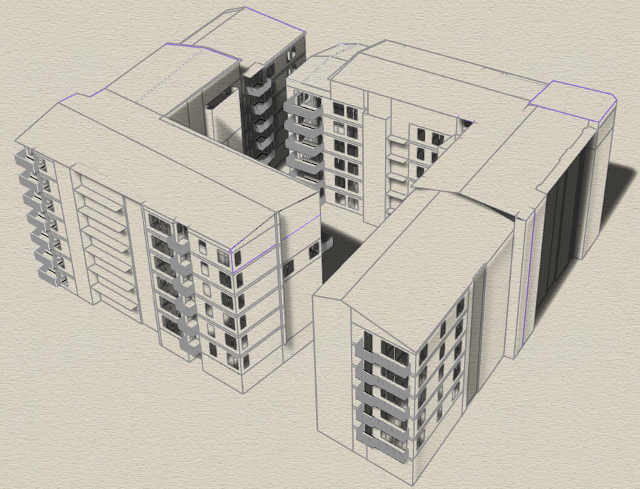
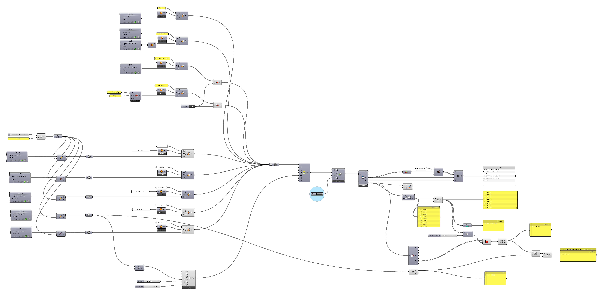
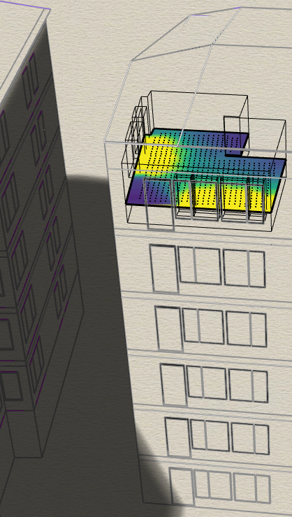

# Daylight Factor (DF) computation
The code file stored in this repository computes the mean & median Daylight Factor values over a grid of points (0.2m resolution) placed 0.8m above the floor area of a living room on different floors. The code is to be used to examine the significance of including or excluding facade geometries (e.g. balcony and balcony railings) in daylight simulations such as the DF. It can also be used to test the significance of including exact information on the material and colour of building facades in the computation of the DF daylight metric. The point here is that different materials/colours have varying spectral properties and reflect sunlight differently, something that may affect the daylight access of rooms in densily built urban environments.

 
 

## Daylight Factor definition:
The Daylight Factor is defined as the percentage ratio of the illuminance in a room compared to the illuminance on a horizontal plane under an unobstructed hemisphere with an overcast sky (Dubois et al., 2019).

 
 

</img>

 
 

The DF is used in many official daylight-regulating documents as it is easy to calculate and because the results are easily communicated and understood  within a group of people working on the same project. However, DF has limitations when the shape of a room is irregular or when it includes windows on more than one facades (Bournas & Dubois, 2018). To overcome this obstacle, researchers have intoduced the Median Daylight Factor that is calculating the DF over a grid of evenly spaced sensor points (Mardaljevic & Christoffersen, 2017). 

 

</img>

 

DFp has been shown to correlate strongly with the DFmedian across the room area, which indicates that complying with this criterion is equivalent to achieving a DFmedian of 1% over 50% of the room area (Bournas, 2020). European recommendations regarding appropriate internal illuminance levels have been found to be equivalent to a DFmedian of 2.1%  (Mardaljevic & Christoffersen, 2013)

 
 

## Input data:
- 3D city model including detailed building exterior and interior information (equivalent to [CityGML LOD4](https://www.sciencedirect.com/science/article/pii/S0198971516300436?via%3Dihub)) like e.g. floor surface, windows, room ceiling, balconies, balcony railings, etc. 

 

</img>

 
 

## Requirements:

- An installed version of [Rhino 7](https://www.rhino3d.com/) with the following tools:
  - [Climate Studio](https://www.solemma.com/climatestudio?gclid=Cj0KCQiA6fafBhC1ARIsAIJjL8mMBqtiBLklABOnztZ7fa2CbLVZGWax759uG0MbsUMTqEaSxicNspUaAr9SEALw_wcB)

 
 

## Workflow:
The process depicted in this workflow computes the mean & median Daylight Factor values over a grid of points (0.2m resolution) placed 0.8m above the floor area of a living room on different floors. The aforementioned process also calculates the min and max DF-values of a room along with the % of the floor area that complies to the daylight requirement stated in the [Swedish legislation (DF > 1%)](https://www.boverket.se/globalassets/publikationer/dokument/2019/bbr-2011-6-tom-2018-4-english-2.pdf). This implementation considers the effect of including or excluding building facade geometries (e.g. balconies, balcony railings, etc.) that may obstruct daylight access in densily built urban environments. Finally, this implementation also takes into consideration how using different building facade materials and colours affects daylight access.

 

<ins><b>Step 1:</ins></b> Add the geometries (Geometry Pipeline) of the room (walls, ceiling, floor, windows, eaves)   
<ins><b>Step 2:</ins></b> Add the geometries (Geometry Pipeline) of the obstructions (e.g. ground, building facades of surrounding buildings, balconies of surrounding buildings, balcony railings of surrounding buildings)   
<ins><b>Step 3:</ins></b> Add a slider and a panel with the standard height value of a floor (2.79m). Include a multiplier to combine the slider and the floor height values to obtain the elevation coordinates (z-coord) of the different room-related geometries from floor to floor.   
<ins><b>Step 4:</ins></b> Add one Climate Studio *LightingMaterial* module per obstructing geometry to pick an appropriate material and colour with specific spectral properties.   
<ins><b>Step 5:</ins></b> Add one Climate Studio *LightingMaterial* module for every room-related geometry and pick an appropriate material and colour.  
<ins><b>Step 6:</ins></b> Add a Climate Studio *SceneLayer* module to construct a Scene Layer for daylight simulation, one for every geometry.  
<ins><b>Step 7:</ins></b> Add a sensor grid (using the Climate Studio *SensorGrid* module) with 0.2m resolution and placed 0.8m above a room floor surface.  
<ins><b>Step 8:</ins></b> Add a *Boolean Toggle* in combination with two *Cull Pattern* modules to control when balcony and balcony railing geometries are to be included as obstructions in the DF-computation and when not.   
<ins><b>Step 9:</ins></b> Add Climate Studio *DaylightModel* to prepare the scene for running the DF daylight simulation.  
<ins><b>Step 10:</ins></b> Add a Climate Studio *Daylight* module and select *Daylight Factor* as the chosen standard to run the corresponding daylight simulation.  
<ins><b>Step 11:</ins></b> Add a *RUN-button* to control the execution of the DF-computation.   
<ins><b>Step 12:</ins></b> Add a Climate Studio *CSR Result* module to capture the DF-values of the gridpoints and obtain the median and mean value.   
<ins><b>Step 13:</ins></b> Add a Climate Studio *PreviewGrid* module to make the DF-value results visible in Rhino.   
<ins><b>Step 14:</ins></b> Add a Climate Studio *Extract* sensor grid data module, to get the gridpoint DF-values.   
<ins><b>Step 15:</ins></b> Add a *Multiplication* module to get the DF-values expressed as percentages instead of decimal values (e.g. 2.3% instead of 0.023)  
<ins><b>Step 16:</ins></b> Add a *Bounds* module to obtain the min and max DF-values computed for the current execution.   
<ins><b>Step 17:</ins></b> Add a *Larger* module to filter out gridpoints with DF-values lower than 1%.   
<ins><b>Step 18:</ins></b> Add a *DeGrid* module to obtain the Sensor Areas of every grid. If we sum up all the sensor areas we get the total floor area of the room.    
<ins><b>Step 19:</ins></b> Add a *Cull* module and use the list of sensor points whose DF<1% and the list of sensor area per gridpoint as input to filter out the sensor areas of the gridpoints whose DF<1%.    
<ins><b>Step 20:</ins></b> Add a *MassAddition* module to sum uo the sensor areas of all gridpoints whose DF>=1%.    
<ins><b>Step 21:</ins></b> Add an *Area* module to compute the total floor area in m2.    
<ins><b>Step 22:</ins></b> Add a *Division* and a *Multiplication* module to compute the percentage floor area of the room that complies to the DF>=1% requirement.   

</img>

 
 

## Output:
The computed Daylight Factor for every point in the grid is presented in the Rhino environment as a visual output while the corresponding mean and median DF-values along with the percentage of the room's floor area complying to the DF>=1% requirement are exported to a panel inside the Rhino Grasshopper environment.

</img>

 
 

## References:
Dubois, M-C., Gentile, N., Laike, T., Bournas, I., & Alenius, M. (2019). Daylighting and lighting under a Nordic sky. (First ed.) Studentlitteratur AB. 

 
 

## License
Copyright 2023 Sustainable3DCities    
The 3-Clause BSD License  
https://opensource.org/licenses/BSD-3-Clause  
   
Redistribution and use in source and binary forms, with or without modification, are permitted provided that the following conditions are met:

1. Redistributions of source code must retain the above copyright notice, this list of conditions and the following disclaimer.

2. Redistributions in binary form must reproduce the above copyright notice, this list of conditions and the following disclaimer in the documentation and/or other materials provided with the distribution.

3. Neither the name of the copyright holder nor the names of its contributors may be used to endorse or promote products derived from this software without specific prior written permission.

THIS SOFTWARE IS PROVIDED BY THE COPYRIGHT HOLDERS AND CONTRIBUTORS "AS IS" AND ANY EXPRESS OR IMPLIED WARRANTIES, INCLUDING, BUT NOT LIMITED TO, THE IMPLIED WARRANTIES OF MERCHANTABILITY AND FITNESS FOR A PARTICULAR PURPOSE ARE DISCLAIMED. IN NO EVENT SHALL THE COPYRIGHT HOLDER OR CONTRIBUTORS BE LIABLE FOR ANY DIRECT, INDIRECT, INCIDENTAL, SPECIAL, EXEMPLARY, OR CONSEQUENTIAL DAMAGES (INCLUDING, BUT NOT LIMITED TO, PROCUREMENT OF SUBSTITUTE GOODS OR SERVICES; LOSS OF USE, DATA, OR PROFITS; OR BUSINESS INTERRUPTION) HOWEVER CAUSED AND ON ANY THEORY OF LIABILITY, WHETHER IN CONTRACT, STRICT LIABILITY, OR TORT (INCLUDING NEGLIGENCE OR OTHERWISE) ARISING IN ANY WAY OUT OF THE USE OF THIS SOFTWARE, EVEN IF ADVISED OF THE POSSIBILITY OF SUCH DAMAGE.

